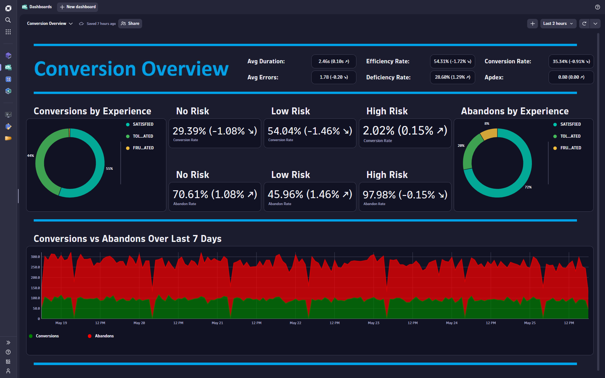
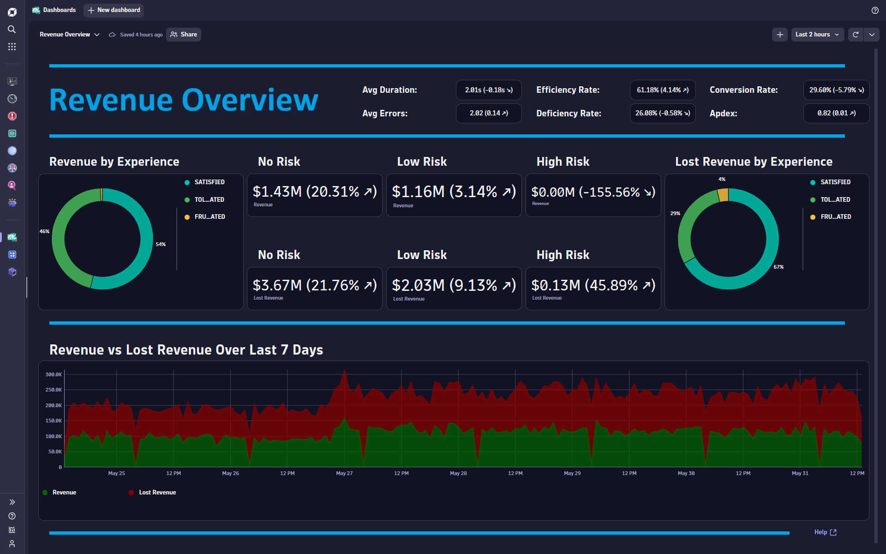
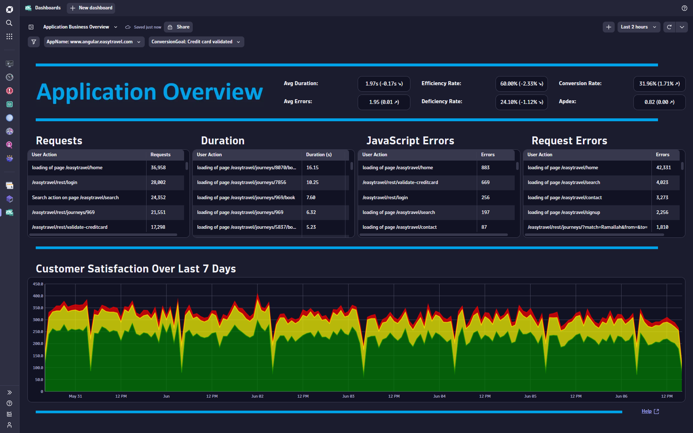
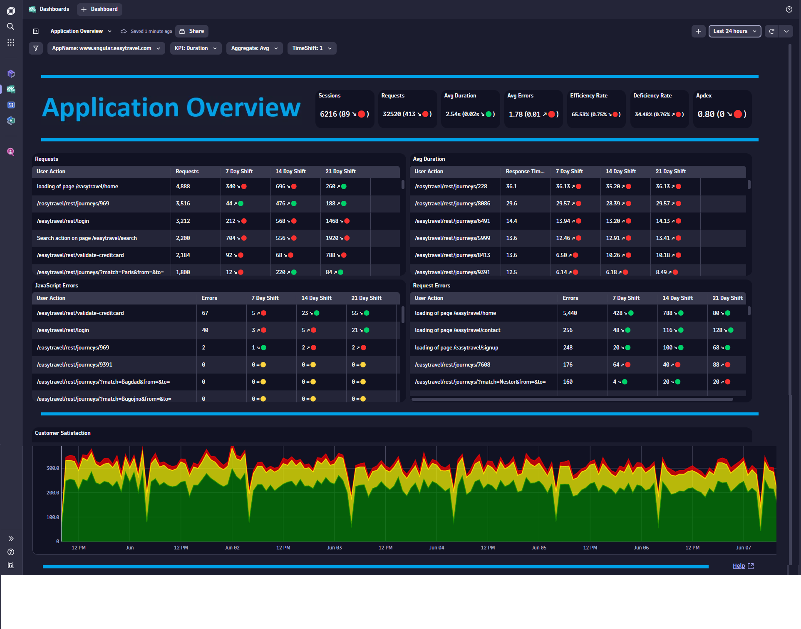
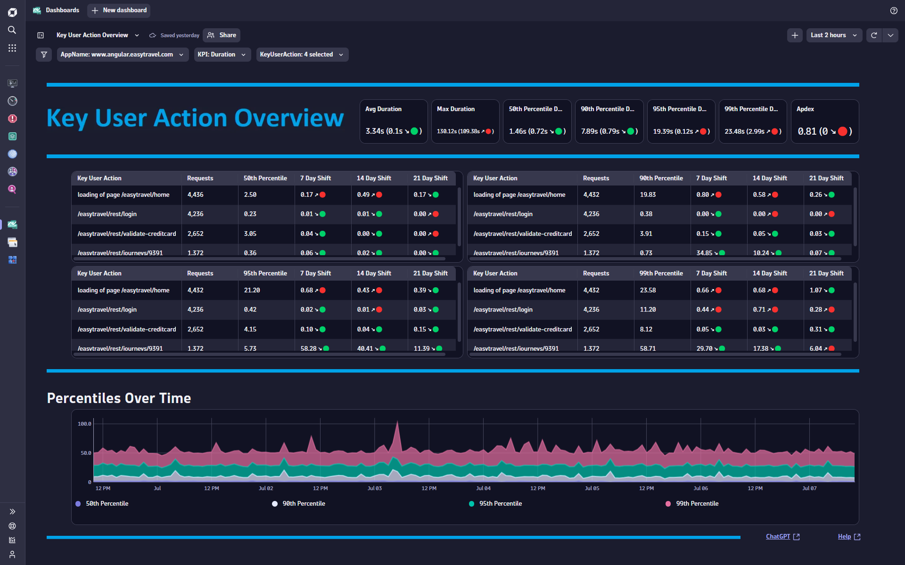
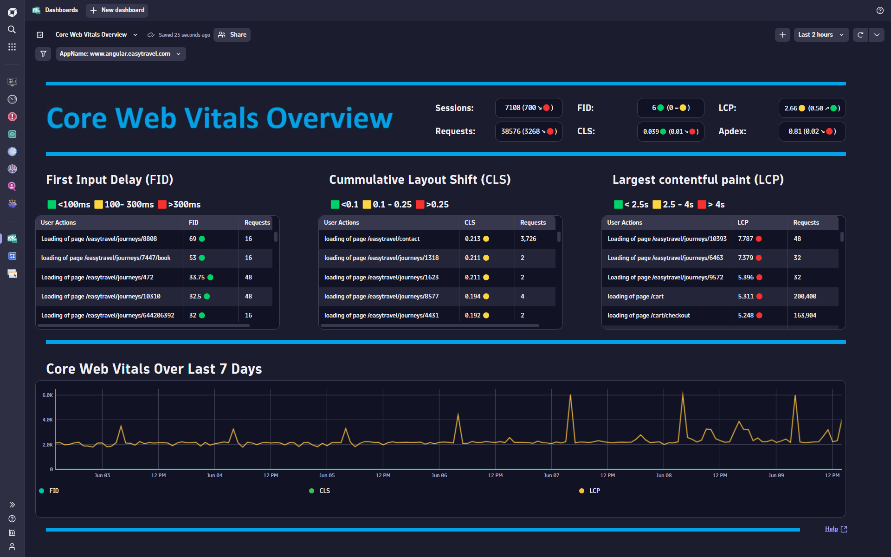
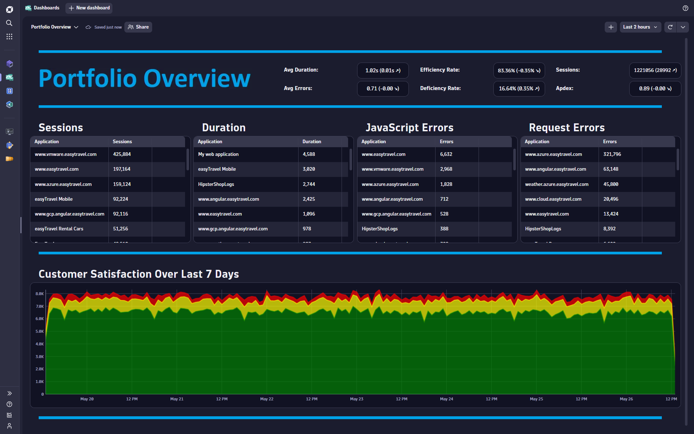

# Dynatrace Gen3 Dashboards

This repo provides Business Grade Dashboards for Dynatrace Gen3. Click on any Dashboard ReadMe file for a detailed description of the Dashboard, Use Cases, Install Instructions and much more. You can download/upload any content and use the dashboard as is. Or you can take certain portions of the dashboard, remove/add content to fit your specific use case. If you are interested in building your own content from scratch within your wireframe, here are a few tile and variable examples to get you started.

## Code Tile Examples

- [Single Value](https://github.com/TechShady/Dynatrace-Dashboards-Gen3/blob/main/SingleValue.json) 
- [Table](https://github.com/TechShady/Dynatrace-Dashboards-Gen3/blob/main/Table.json) 
- [Categorical Bar Chart](https://github.com/TechShady/Dynatrace-Dashboards-Gen3/blob/main/CBC.json) 
- [Timeseries Chart](https://github.com/TechShady/Dynatrace-Dashboards-Gen3/blob/main/TSC.json) 
- [Pie Chart](https://github.com/TechShady/Dynatrace-Dashboards-Gen3/blob/main/PC.json)

## Code Variable Examples

- [Applications](https://github.com/TechShady/Dynatrace-Dashboards-Gen3/blob/main/Apps.json) 
- [FrictionKPI](https://github.com/TechShady/Dynatrace-Dashboards-Gen3/blob/main/FrictionVariable.json) 

## Business Dashboard Content Library

- [User Experience Overview Dashboard](https://github.com/TechShady/Dynatrace-Dashboards-Gen3/blob/main/ReadMeExecutiveOverview.md)

- [Conversion Overview Dashboard](https://github.com/TechShady/Dynatrace-Dashboards-Gen3/blob/main/ReadMeConversionOverview.md)

- [Revenue Overview Dashboard](https://github.com/TechShady/Dynatrace-Dashboards-Gen3/blob/main/ReadMeRevenueOverview.md)

- [Application Business Overview Dashboard](https://github.com/TechShady/Dynatrace-Dashboards-Gen3/blob/main/ReadMeApplicationBusinessOverview.md)

- [Application Overview Dashboard](https://github.com/TechShady/Dynatrace-Dashboards-Gen3/blob/main/ReadMeApplicationOverview.md)

- [Key User Action Overview Dashboard](https://github.com/TechShady/Dynatrace-Dashboards-Gen3/blob/main/ReadMeKUAOverview.md)

- [Core Web Vitals Overview Dashboard](https://github.com/TechShady/Dynatrace-Dashboards-Gen3/blob/main/ReadMeCoreWebVitalsOverview.md)

- [Portfolio Overview Dashboard](https://github.com/TechShady/Dynatrace-Dashboards-Gen3/blob/main/ReadMePortfolioOverview.md)

- [Performance Conversion Analysis (Application) Dashboard](https://github.com/TechShady/Dynatrace-Dashboards-Gen3/blob/main/ReadMePerformanceConversionAnalysisApplication.md)

- [Performance Conversion Analysis (KUA) Dashboard](https://github.com/TechShady/Dynatrace-Dashboards-Gen3/blob/main/ReadMePerformanceConversionAnalysisKUA.md)

