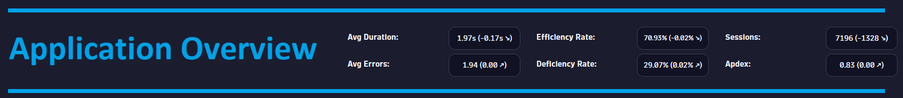
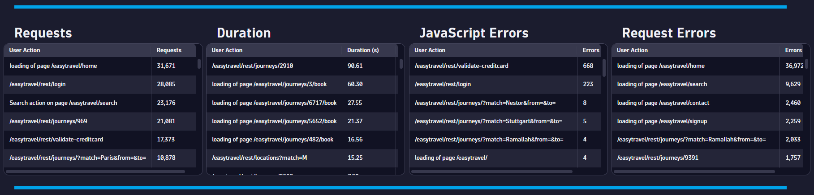
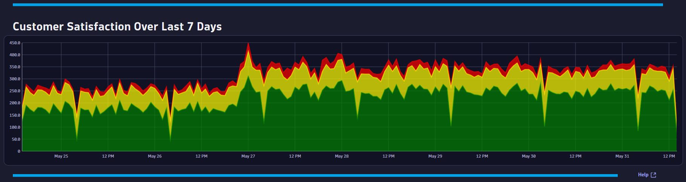

# Conversion Overview Dashboard
This dashboard provides an executive level for an Applications.

# Prerequisites

Required: [Create a conversion goal](https://www.dynatrace.com/support/help/platform-modules/digital-experience/web-applications/analyze-and-use/define-conversion-goals) for a user action that indicates a converted user session (i.e. Order Confirmation Page).

# Target Audience

- Application Owner
- Line of Business
- Executive

# Use Cases

- What is my APDEX score?
- Is my user traffic increasing?
- Do I have application efficiency issues?
- Do I have any poor performance trend issues?
- Do I have any error trend issues?
- Is my application experience high error rates?
- Is my application suffering from poor performance?
- What days/times do I have good user experiences?

# Install Instructions

- Download https://github.com/TechShady/Dynatrace-Dashboards-Gen3/blob/main/Application%20Overview.json
- Edit the json file and replace the following
    - ${app.name} -> The name of your application (i.e. www.angular.easytravel.com)
    - ${uspConversion} -> Your conversion goal (i.e. useraction.matchingconversiongoals=\"Credit card validated\")
- Save the json file
- Launch the new Gen3 UI
- Select the Dashboard app
- In the upper righthand corner, select Import
- Refresh your dashboard list and launch your Dashboard

# User Guide

The Application Overview Dashboard is broken down into three sections.

The top section is called the KPI banned. This section has the following KPIs:
- Avg Duration: Time between the initial user input and complete page load.
- Avg Errors: Average number of Request and JavaScript Errors.
- Efficiency Rate: Rate of sessions that converted with good user experience. A perfect efficiency rate is 100.
- Deficiency Rate: Rate of sessions that did not convert with poor user experience. A perfect deficiency rate is 0.
- Sessions: The total number of user sessions for your applications.
- Apdex: Application Performance Index is a standard developed by an alliance of companies for measuring the performance of applications. A perfect Apdex score is 1.

Each KPI cell displays the current value for the last 24 hours. Each KPI is compared to a seven-day time shift over the past 24 hours and will display, in parentheses, the KPI difference and trend direction.

The middle section displays the following tables: 
- Sessions - The number of User Sessions for your application.
- Duration - The average user action Duration for your application.
- JavaScript Errors - The number of JavaScript Errors for your application.
- Request Errors - The number of Request Errors for your application.
 

The bottom section charts customer satisfaction (Satisfied, Tolerated, Frustrated) over the last seven days.
