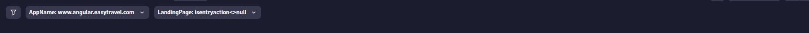
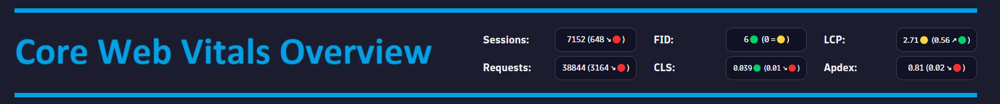
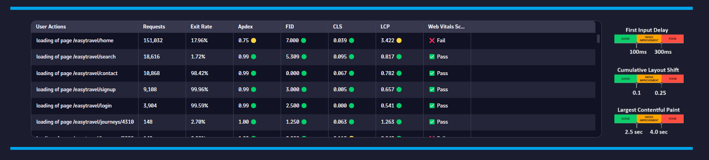
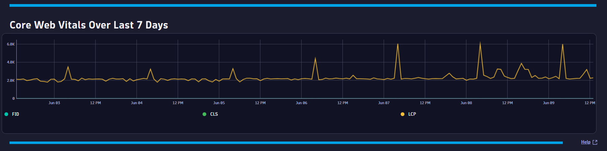

# Core Web Vitals Overview Dashboard
This dashboard provides a Core Web Vitals overview for your applications.

# Prerequisites

None.

# Target Audience

- Application Owner
- Line of Business
- Executive

# Use Cases

- What is my overall APDEX score?
- Is my user traffic increasing?
- Do I have FID issues?
- Do I have LCP issues?
- Do I have CLS issues?
- What days/times do I have poor Core Web Vitals experiences?

# Install Instructions

- Download https://github.com/TechShady/Dynatrace-Dashboards-Gen3/blob/main/Core%20Web%20Vitals%20Overview.json
- Launch the new Gen3 UI
- Select the Dashboard app
- In the upper righthand corner, select Upload and select your json file
- Refresh your dashboard list and launch your Dashboard

# User Guide

The Core Web Vitals Overview Dashboard is broken down into four sections.

The dashboard header section has one filter that you can apply to your Core Web Vitals Overview Dashboard:
- AppName - List of applications currently monitored by Dynatrace. Select the application to filter the dashboard for any application.

The top section is called the KPI banner. This section has the following KPIs:
- Sessions: Total number of user sessions for your application.
- Requests: Total number of user actions for your application.
- FID: First Input Delay (FID) is the stable Core Web Vital metric for measuring load responsiveness because it quantifies the experience users feel when trying to interact with unresponsive pages—a low FID helps ensure that the page is usable.
- CLS: Cumulative Layout Shift (CLS) is a Core Web Vital that measures the cumulative score of all unexpected layout shifts within the viewport that occur during a page's entire lifecycle. Its aim is to measure a page's “visual stability,” as that heavily influences the user experience.
- LCP: Largest Contentful Paint (LCP) is a Core Web Vital that measures the time in seconds from when the page starts loading to when the largest text block or image element is rendered on the screen. Its aim is to measure when the page's main contents have finished loading.
- Apdex: Application Performance Index is a standard developed by an alliance of companies for measuring the performance of applications. A perfect Apdex score is 1.

Each KPI cell displays the current value for the last 24 hours. Each KPI is compared to a seven-day time shift over the past 24 hours and will display, in parentheses, the KPI difference and trend direction.

The middle section displays the following tables: 
- FID - First Input Delay and the number of User Action requests.
- CLS - Cumulative Layout Shift and the number of User Action requests.
- LCP - Largest Contentful Paint and the number of User Action requests.

The bottom section charts FID, CLS and LCP over the last seven days.
