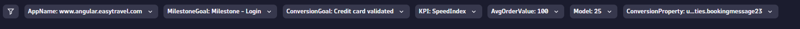
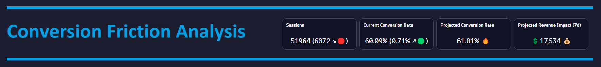
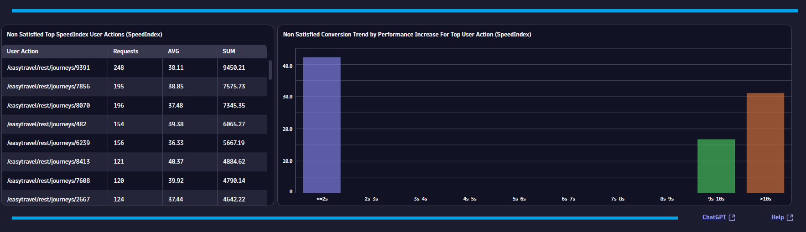

# Performance Conversion Analysis (Application) Dashboard

This dashboard provides a performance conversion analysis for your applications and tells you if the performance for any User Action impacts your conversion rate.

# Prerequisites

Required: [Create a conversion goal](https://www.dynatrace.com/support/help/platform-modules/digital-experience/web-applications/analyze-and-use/define-conversion-goals) for a user action that indicates a completed business transaction (i.e. Order Confirmation Page).

Required: [Create a session property](https://www.dynatrace.com/support/help/platform-modules/digital-experience/custom-applications/additional-configuration/define-custom-action-and-session-properties) from your conversion page (i.e. String: OrderCompleted).

# Target Audience

- Application Owner
- Line of Business
- Executive
- Web Developer

# Use Cases

-	Do I have a problem with my website?
-	Is this problem impacting my users?
-	What KPI is causing the problem?
-	What user action(s) do I need to tune?
-	How much improvement do I need to achieve to maximize conversions?
-	How much is this problem costing my business?
-	How do I fix this problem?

# Install Instructions

- Download [Dashboard JSON](https://github.com/TechShady/Dynatrace-Dashboards-Gen3/blob/main/Performance%20Conversion%20Analysis%20(Application).json)
- Launch the new Gen3 UI
- Select the Dashboard app
- In the upper righthand corner, select Upload and select your json file
- Refresh your dashboard list and launch your Dashboard
- Modify the KPI variable filter and change appName and conversionGoal settings.

# User Guide

The Conversion Friction Analysis Dashboard is broken down into four sections.

The dashboard header section has six filters that you can apply to your Conversion Friction Analysis Dashboard and one filter (KPI) that automatically determines the KPI that has the greatest impact on your conversion rate:
- AppName - List of applications currently monitored by Dynatrace. Select the application to filter the dashboard for any application.
- MilestoneGoal - List of conversion goals. Select the conversion goal that indicates the start of a business transaction.
- ConversionGoal - List of conversion goals. Select the conversion goal that indicates the completion of a business transaction.
- KPI - This filter automatically determines the KPI that has the greatest impact on your conversion rate.
- AvgOrderValue - Select your average order value. If your application is not revenue generating, then select a value that reflects the internal cost associated with your business transaction. You can also modify the value list to add/adjust values presented.
- Model - This is a model factor used to project conversion and revenue impacts. This value is a percentage and is used to filter out noise. For example, a value of 25 will consider 25% of projected sessions that are abandoning with problems.

The top section is called the KPI banner. This section has the following KPIs:
- Sessions: Total number of user sessions.
- Current Conversion Rate: Rate of sessions that converted.
- Projected Conversion Rate: Rate of sessions that are projected to convert if the KPI problem is neutralized.
- Projected Revenue Impact: Projected increase in revenue over seven days if the KPI problem is neutralized.

The first two cells display the current value for the last 24 hours. These KPIs are compared to a seven-day time shift over the past 24 hours and will display, in parentheses, the KPI difference and trend direction.

The middle section provides a detailed summary about the KPI that has the greatest impact on your conversion rate. The summary will tell you the difference between converting and abandoning sessions and will project improvements if the difference is neutralized. 

The bottom section displays a table and a chart. The table lists the top user actions sorted by KPI impact. The chart plots the conversion rate split by the KPI performance (<2s, 2s-3s, etc). This section helps you understand the user action that needs to be tuned and the optimal goal for maximizing conversions. The bottom right corner has two links. The ChatGPT link will detail how to tune the KPI with expert recommendations and the Help link provides dashboard help.
